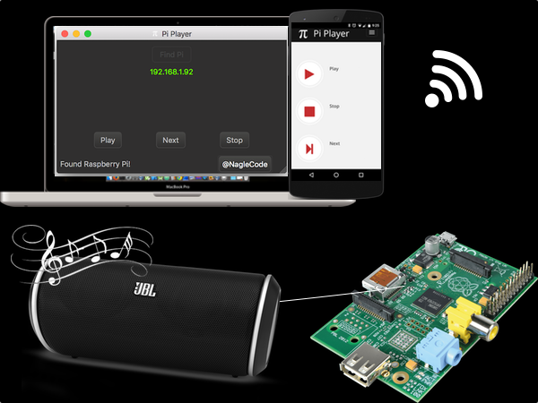

# Pi Player: The Raspberry Pi Network Audio Player

Ever wanted your Raspberry Pi to act as a network-controlled audio player? Pi Player accomplishes this goal. It consists of 3 components acting independently to make the system work.

1. [Desktop app](desktop/) - Used for discovering the Raspberry Pi and as an example of basic network TCP and UDP commands.
1. [Web app](www/) - A responsive web UI to control the Raspberry Pi audio through phones and web browsers. This is an easier alternative than building a from-scratch mobile app.
1. [Pi service](pi/) - A TCP and UDP listener service that actually launches the audio files when requested.




## Desktop app
The [Desktop app](desktop/) provides basic control and discoverability of the Raspberry Pi. It was written in C++ with the Qt SDK and runs on Windows, Mac, and Desktop Linux.


Click "Find Pi", and the desktop app will send out a broadcast UDP packet and report the first one it finds. The other buttons become enabled allowing basic audio control.

If the Raspberry Pi was given a static IP address, then the desktop app is largely unnecessary. Control can be done through the web app.

## Web app

The [Web app](www/) is placed directly in `/var/www` of the Raspberry Pi. It provides the same control as the desktop app. The difference is no software is needed to be installed -- only a web browser. The web app was built in PHP, JavaScript, and the Bootstrap framework so it will be responsive.


By making your web port available to the internet, the Pi Player is now an IoT-enabled device. Play audio at home. The back-end service can remain closed to the Internet because the PHP commands are connecting through 127.0.0.1.  

## Pi service

The [Pi listener service](pi/) starts UDP and TCP listeners on port 15000. These listen for commands and actually invoke the audio player (mpg123) to start the MP3. The audio files must be MP3s located in the home directory. The service was written in C++ using the Qt SDK.

```
sudo apt-get install qt5-default build-essential mpg123
qmake && make
sudo daemon ./simpleTCPandUDPserver
```

## Development and Troubleshooting
Pi Player was heavily tested and developed using the open source project [Packet Sender](https://github.com/dannagle/PacketSender). The actual ASCII commands being sent are listed below. Send to ports 15000 for both UDP and TCP.

* Broadcast UDP: Find Units
* Unicast TCP:
* UnicastTCP: next
* UnicastTCP: stop


## Video Demo
https://www.youtube.com/watch?v=4JXBG0TkA1g


## Static Live Web Demo

Site can be [viewed here](http://piplayer.naglecode.com/). Commands have been disabled.


## License
All components are GPL v2 or Later. The "www" portion is based heavily on the [Packet Sender web project](https://github.com/dannagle/PacketSender-Website) if you'd prefer an MIT license.


## Copyright

This project is wholly owned and copyright &copy;  -  [@NagleCode](http://twitter.com/NagleCode) - [DanNagle.com](http://DanNagle.com)  
