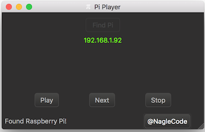

## Pi Player: Desktop Component

For discoverability and control is an a convenient app, a desktop component is provided.


## Screenshot

Click "Find Pi" to find the Raspberry Pi running the server. The IP found will be displayed in green. From there, the commands will be enabled.




## UDP Commands

Pi Player listens on port 15000 for UDP. It is used to discover the Pi Player.Send a broadcast packet (255.255.255.255) with this data

* Find Units
```
Find Units
```


## TCP Commands

Pi Player listens on port 15000 for TCP too. It accepts commands as follows.

* Play
```
play
```
* Next
```
next
```
* Stop
```
stop
```

## Use Packet Sender Instead

There is no task that the desktop component does that could not be easily replicated by [Packet Sender](http://packetsender.com). Use the ASCII entry to send the command and look at the log to see the result.


## License
All components are GPL v2 or Later.


## Copyright

This project is wholly owned and copyright &copy;  -  [@NagleCode](http://twitter.com/NagleCode) - [DanNagle.com](http://DanNagle.com)  
