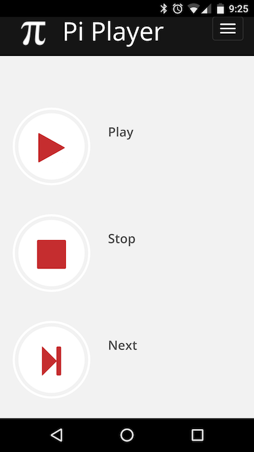

## Pi Player: Web App Component

The web app component of Pi Player is a responsive PHP-based web application.

## Installation

The Pi Player runs on [Raspbian](https://www.raspbian.org/).

```
sudo apt-get install apache2
sudo apt-get install php5
sudo apt-get install libapache2-mod-php5
sudo /etc/init.d/apache2 restart
```

Afterwards, install everything in the `www` to your `/var/www/` directory.


## Screenshots

Desktop version


Mobile version




## License
All components are GPL v2 or Later. The web UI is mostly a fork of the [Packet Sender web site](https://github.com/dannagle/PacketSender-Website) if you prefer MIT Licensed based.


## Copyright

This project is wholly owned and copyright &copy;  -  [@NagleCode](http://twitter.com/NagleCode) - [DanNagle.com](http://DanNagle.com)  
